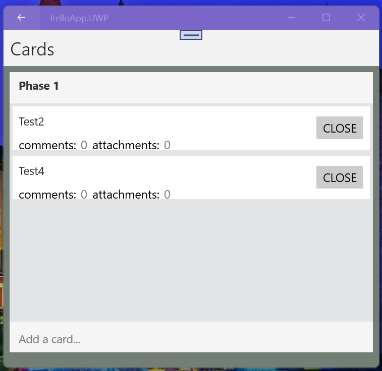

# TrelloApp

## Little intro 
TrelloApp for Windows 10 (Mobile too), Android (Surface Duo), iOS (Xamarin edition) . 

Developers only ;) 

## Screenshots

## Getting your "Trello keys"

Please read this (https://developer.atlassian.com/cloud/trello/guides/rest-api/api-introduction/) :
"The Trello API is extremely powerful and fun to use. 
Building a full application with Trello for web or mobile means getting to know the various concepts and models making up Trello.

We're going to walk you through getting your API key and token, making a few requests, 
and then give a high-level look at some of the most popular API resources..."

Then use your PC to login to Trello (https://trello.com) and generate your magic keys (https://trello.com/1/appKey/generate)

## Coding "workbench"

1. Visual Studio 2022

2. Xamarin Forms workload

3. Win SDK 15063

## Test scenario

Compile for needed platform (x32 or ARM)

Start app

Fix app settings 

Explore some simple "Trello mirroring", i.e. your boards, cards... =)
 

## Project status

phase 1 Intro/RnD +- 20/100

phase 2 Design - 0/100

phase 3 Tech. project - 0/100

phase 4 Dev. project  +- 5/100

phase 5 Tests/Intro   - 0/100

## Contribute!
There's still a TON of things missing from this proof-of-concept (MVP) and areas of improvement 

With best wishes,

  [m][e] 2021

YaMu is RnD project only. AS-IS. No support. Distributed under the MIT License.
